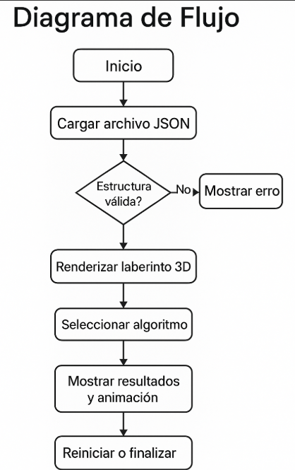

# Manual Técnico - MazeBot 3D

## Descripción General

MazeBot 3D es una aplicación web educativa que permite al usuario visualizar la resolución de laberintos utilizando algoritmos de búsqueda clásicos. Estos laberintos se representan en un entorno tridimensional (3D) utilizando la biblioteca Three.js, y los algoritmos implementados son BFS, DFS y A*.

---

## Guía de Instalación

### Requisitos:
- Navegador web moderno (Google Chrome, Firefox, Edge).
- No requiere instalación de servidor ni dependencias locales.

### Pasos para ejecutar el sistema:
1. Descargar o clonar el proyecto.
2. Abrir `index.html` desde el navegador.
3. Utilizar `admin.html` para pruebas administrativas.
4. Cargar uno de los archivos `.json` provistos como `facil.json` o `medio.json`.

---

## Arquitectura del Sistema

### Estructura del Proyecto:

```
/
├── index.html               ← Página principal de interacción
├── admin.html               ← Panel de administración (subida y validación de JSON)
├── facil.json, medio.json   ← Archivos JSON de laberintos de ejemplo
├── /assets
│   ├── /css
│   │   └── laberinto.css    ← Estilos visuales del entorno
│   └── /scripts
│       ├── index.js         ← Lógica principal (renderizado + eventos)
│       ├── robot.js         ← Control del modelo 3D animado
│       └── algoritmos.js    ← Implementación de BFS, DFS y A*
```

---

## Diagrama de Flujo del Sistema




---

## Herramientas Utilizadas

| Herramienta       | Uso principal                                   |
|-------------------|--------------------------------------------------|
| JavaScript (ES6)  | Lógica de la aplicación                         |
| Three.js          | Renderizado 3D del laberinto y entorno          |
| SweetAlert2       | Ventanas modales y validaciones visuales        |
| GLTFLoader        | Carga de modelos 3D como el robot               |
| OrbitControls     | Movimiento libre de la cámara                   |
| HTML / CSS        | Estructura visual y diseño responsivo           |

---

## Justificación y Descripción de los Algoritmos

### 🔹 BFS (Breadth-First Search)
**Justificación:**  
BFS fue elegido por su capacidad de encontrar siempre el camino más corto entre el punto de inicio y el final. Esto permite establecer un punto de comparación base contra otros algoritmos. Es ideal para laberintos simples o simétricos, y útil para demostrar cómo se expande uniformemente en todas las direcciones.

### 🔹 DFS (Depth-First Search)
**Justificación:**  
DFS permite observar cómo una búsqueda más profunda puede recorrer caminos largos sin evaluar todas las posibilidades. Aunque no garantiza encontrar la solución óptima, su velocidad en ciertos escenarios lo convierte en una opción interesante para compararla con BFS. También permite visualizar un enfoque más recursivo y directo.

### 🔹 A* (A-Star)
**Justificación:**  
A* fue incorporado por ser un algoritmo heurístico que balancea entre exploración y eficiencia. Utiliza la distancia Manhattan como heurística, lo que lo hace ideal para laberintos cuadriculados. Su inclusión muestra cómo una búsqueda informada puede reducir significativamente el tiempo de cálculo y la cantidad de nodos explorados.


### 🔹 BFS (Breadth-First Search)
- Garantiza encontrar el **camino más corto**.
- Útil en laberintos donde se desea eficiencia y exhaustividad.
- Recorre nivel por nivel todos los caminos posibles.

### 🔹 DFS (Depth-First Search)
- Explora un camino hasta el final antes de retroceder.
- Puede encontrar soluciones más rápido en algunos escenarios, pero **no garantiza la más corta**.
- Es simple de implementar y visualmente distinta.

### 🔹 A* (A-Star)
- Usa una heurística (distancia de Manhattan) para optimizar la búsqueda.
- Balance ideal entre eficiencia y calidad del camino.
- Es el algoritmo más inteligente entre los tres para encontrar la mejor ruta en menos tiempo.

### Elección de algoritmos:
Se eligieron estos tres algoritmos por su popularidad en IA y porque permiten comparar visualmente sus comportamientos. Además, ofrecen un equilibrio entre exploración total, profundidad y uso de heurística.

---

## Validación de Archivos JSON

Antes de renderizar el laberinto, se valida que:
- `ancho` y `alto` sean enteros mayores que 0.
- `inicio` y `fin` estén dentro del rango del laberinto.
- `paredes` contenga coordenadas válidas.

Un error en cualquiera de estos campos genera alertas visuales.

---

## Archivos JSON de Ejemplo

### Ejemplo: `facil.json`
```json
{
  "ancho": 5,
  "alto": 5,
  "inicio": [0, 0],
  "fin": [4, 4],
  "paredes": [[1,0], [1,1], [1,2]]
}
```

### Ejemplo: `medio.json`
```json
{
  "ancho": 10,
  "alto": 10,
  "inicio": [1, 0],
  "fin": [1, 9],
  "paredes": [[2,0], [3,0], [3,1], [4,1], ...]
}
```

---

## Autores del Proyecto

- Sebastián Godoy 
- José Martínez 
- Henderson Batén 

---

**Proyecto desarrollado para el curso de Inteligencia Artificial 1 (IA1 - G21)**.
