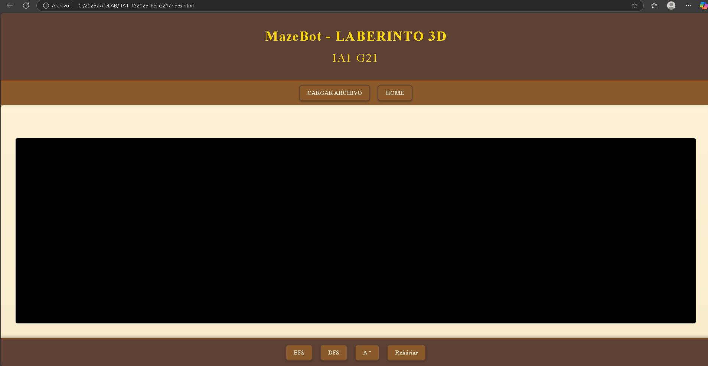
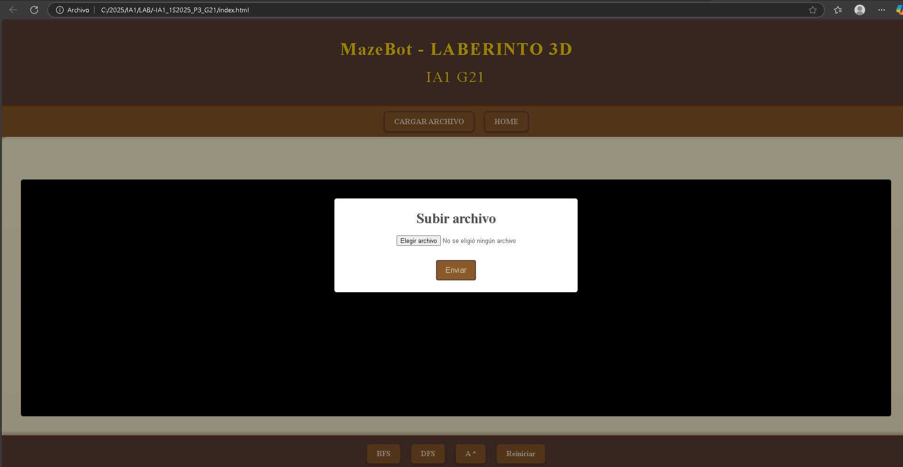
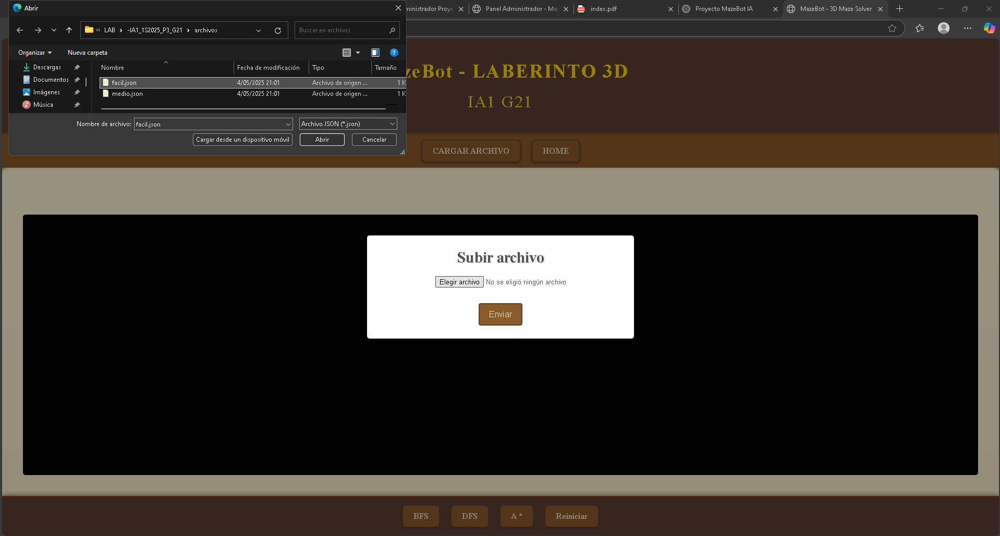
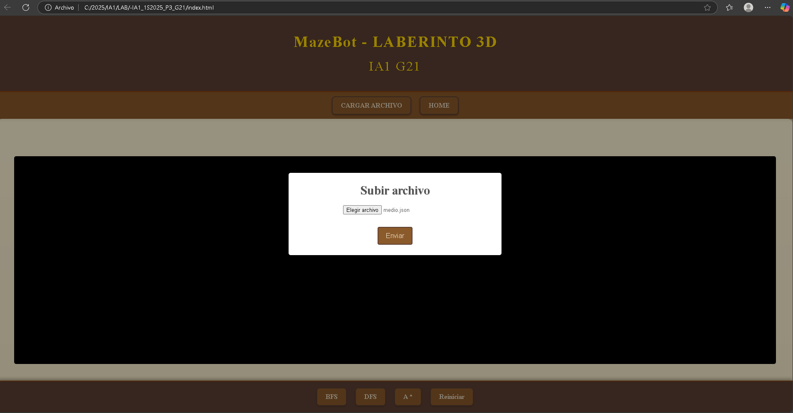
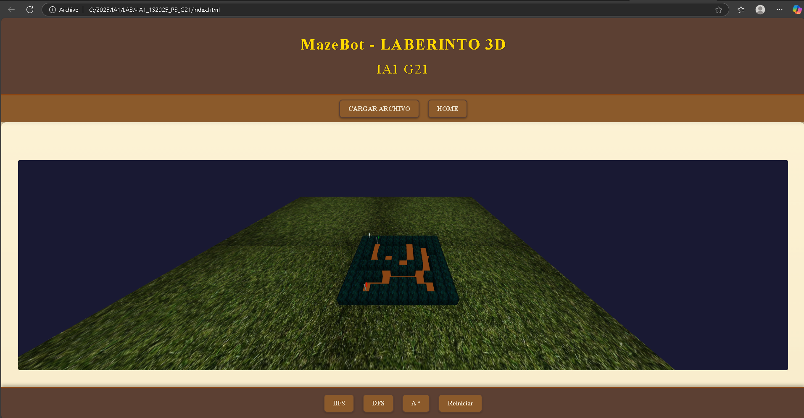
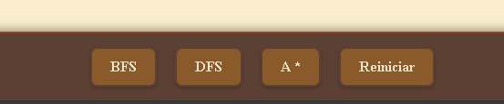
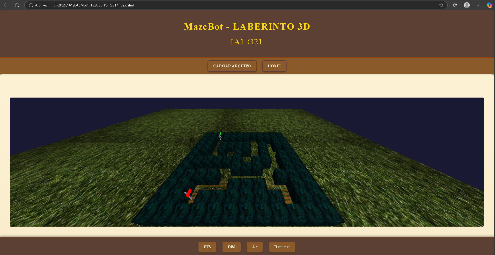
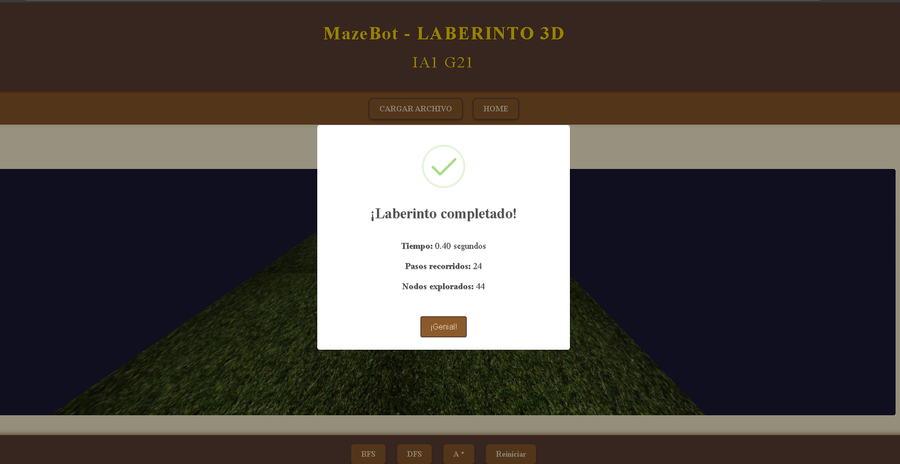
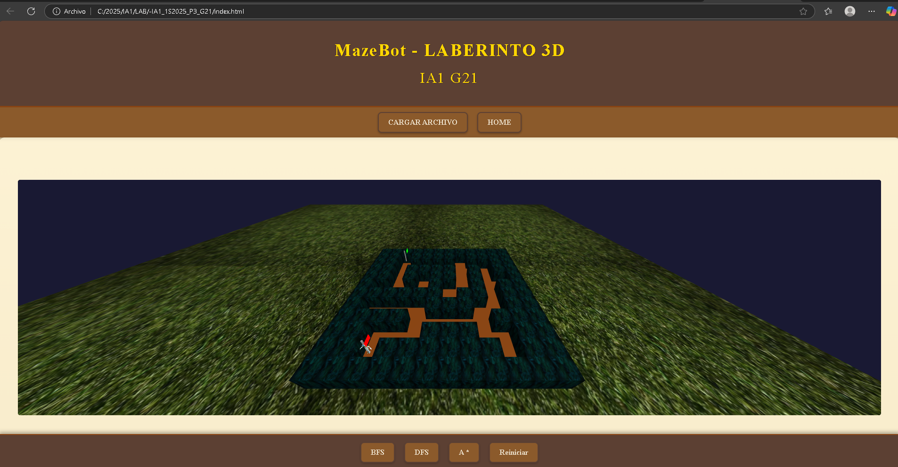
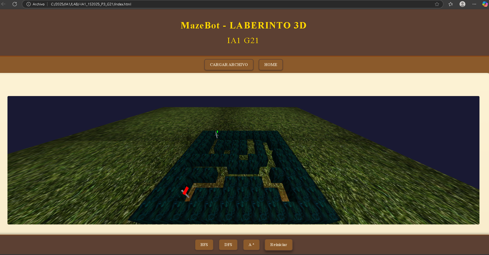

# Manual de Usuario - MazeBot 3D

## Descripción General

MazeBot 3D es una aplicación web interactiva que permite al usuario cargar laberintos personalizados en formato JSON, y visualizar cómo un robot los resuelve utilizando algoritmos de búsqueda como BFS, DFS o A*. El sistema está diseñado con fines educativos para demostrar visualmente cómo operan estos algoritmos.

---

## ¿Cómo usar el sistema?

### 1. Iniciar la aplicación
Abre el archivo `index.html` en tu navegador. Se mostrará la interfaz principal con botones de navegación.


### 2. Cargar un archivo JSON
Haz clic en el botón **“CARGAR ARCHIVO”** y selecciona un archivo `.json` con la estructura del laberinto.





>  Ejemplo de estructura válida:
```json
{
  "ancho": 5,
  "alto": 5,
  "inicio": [0, 0],
  "fin": [4, 4],
  "paredes": [[1,0], [1,1], [1,2]]
}
```




Una vez cargado correctamente, se renderiza el laberinto en 3D.



### 3. Seleccionar un algoritmo
Haz clic en uno de los botones disponibles en la parte inferior:
- `BFS` para Breadth-First Search.
- `DFS` para Depth-First Search.
- `A*` para búsqueda heurística.




### 4. Ver resultados
El robot se moverá por el laberinto mostrando el recorrido calculado. Se mostrará una alerta con:
- Tiempo de ejecución.
- Cantidad de pasos.
- Nodos explorados.










### 5. Reiniciar
Haz clic en **“Reiniciar”** para volver al punto de inicio y probar otro algoritmo o archivo.

---


##  Problemas comunes y soluciones

| Problema | Posible causa | Solución |
|---------|----------------|----------|
| El laberinto no se carga | JSON mal formado | Verifica que el archivo contenga `ancho`, `alto`, `inicio`, `fin`, `paredes`. |
| El robot no se mueve | No se seleccionó algoritmo | Selecciona BFS, DFS o A* tras cargar el laberinto. |
| El camino no se encuentra | No existe una ruta válida | Asegúrate de que haya un camino libre entre inicio y fin. |
| El archivo no se selecciona | Botón no responde |  recarga la página. |

---

##  Créditos

Proyecto desarrollado por estudiantes del curso **IA1 G21**:

- Sebastián Godoy
- José Martínez
- Henderson Batén